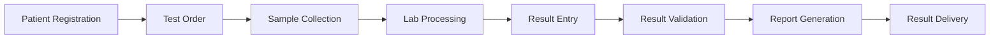

# User Guide Overview

Welcome to the LabFlow User Guide! This comprehensive guide will help you master all features of LabFlow.

## 👥 User Roles

LabFlow supports multiple user roles, each with specific permissions:

### Admin
- Full system access
- User management
- System configuration
- All lab operations

### Lab Manager
- Lab operations management
- Staff scheduling
- Inventory management
- Report generation

### Lab Technician
- Sample processing
- Result entry
- Basic reporting
- QC management

### Phlebotomist
- Patient check-in
- Sample collection
- Label printing
- Collection tracking

### Clinician
- Order tests
- View results
- Patient management
- Report access

### Receptionist
- Patient registration
- Appointment scheduling
- Basic patient info
- Payment collection

## 🎯 Core Workflows

### 1. Patient Journey

### 2. Sample Lifecycle

1. **Collection** - Phlebotomist collects sample
2. **Accessioning** - Sample receives unique ID
3. **Processing** - Sample prepared for analysis
4. **Analysis** - Tests performed
5. **Validation** - Results reviewed
6. **Reporting** - Results finalized
7. **Archive** - Sample stored/disposed

## 📋 Module Guide

### Patient Management
- [Patient Registration](./patients/registration)
- [Patient Search](./patients/search)
- [Medical History](./patients/medical-history)
- [Patient Portal](./patients/portal)

### Test Management
- [Test Catalog](./tests/catalog)
- [Order Creation](./tests/ordering)
- [Test Panels](./tests/panels)
- [Priority Handling](./tests/priority)

### Sample Management
- [Sample Collection](./samples/collection)
- [Barcode Management](./samples/barcoding)
- [Sample Tracking](./samples/tracking)
- [Storage Management](./samples/storage)

### Result Management
- [Result Entry](./results/entry)
- [Critical Values](./results/critical-values)
- [Result Validation](./results/validation)
- [Amendment Process](./results/amendments)

### Billing & Insurance
- [Invoice Creation](./billing/invoices)
- [Insurance Claims](./billing/insurance)
- [Payment Processing](./billing/payments)
- [Financial Reports](./billing/reports)

### Quality Control
- [QC Setup](./quality-control/setup)
- [Daily QC](./quality-control/daily-qc)
- [Levey-Jennings Charts](./quality-control/charts)
- [Troubleshooting](./quality-control/troubleshooting)

### Reporting
- [Standard Reports](./reports/standard)
- [Custom Reports](./reports/custom)
- [Report Templates](./reports/templates)
- [Export Options](./reports/export)

### Inventory
- [Stock Management](./inventory/stock)
- [Reagent Tracking](./inventory/reagents)
- [Auto-Reordering](./inventory/reordering)
- [Expiry Management](./inventory/expiry)

## 🚀 Getting Started Tasks

### For New Users

1. **Complete Training**
   - Watch onboarding videos
   - Complete interactive tutorials
   - Pass role-specific quiz

2. **Set Up Profile**
   - Upload profile photo
   - Set notification preferences
   - Configure dashboard widgets

3. **Learn Key Shortcuts**
   - `Ctrl/Cmd + N` - New patient
   - `Ctrl/Cmd + O` - New order
   - `Ctrl/Cmd + S` - Save
   - `Ctrl/Cmd + F` - Search

### Daily Tasks by Role

#### Lab Technician
- [ ] Run morning QC
- [ ] Process pending samples
- [ ] Enter test results
- [ ] Review critical values
- [ ] Update sample status

#### Phlebotomist
- [ ] Check collection schedule
- [ ] Prepare collection supplies
- [ ] Collect samples
- [ ] Update collection status
- [ ] Handle difficult draws

#### Receptionist
- [ ] Register new patients
- [ ] Schedule appointments
- [ ] Process payments
- [ ] Handle inquiries
- [ ] Update patient info

## 💡 Best Practices

### Data Entry
- Double-check patient identifiers
- Use barcode scanning when available
- Verify critical values
- Document any deviations

### Sample Handling
- Follow chain of custody
- Maintain proper temperature
- Label immediately after collection
- Document collection issues

### Result Management
- Review reference ranges
- Check for delta values
- Validate abnormal results
- Add interpretive comments

### Customer Service
- Maintain patient privacy
- Communicate wait times
- Explain procedures clearly
- Handle complaints professionally

## 🛠️ Troubleshooting

### Common Issues

**Can't find a patient**
- Check alternate spellings
- Search by DOB or MRN
- Verify patient is registered

**Test not available**
- Check test catalog status
- Verify ordering permissions
- Contact lab manager

**Result entry errors**
- Verify units are correct
- Check decimal placement
- Review reference ranges

**Printing problems**
- Check printer status
- Verify label stock
- Clear print queue

## 📱 Mobile App Features

### Patient App
- View test results
- Schedule appointments
- Message providers
- Pay bills

### Staff Apps
- Collection management
- Result entry
- Inventory tracking
- Schedule viewing

## 🔐 Security & Compliance

### HIPAA Requirements
- Minimum necessary access
- Audit trail maintenance
- Secure communication
- Patient privacy

### Password Policy
- Minimum 12 characters
- Mix of character types
- Change every 90 days
- No password reuse

### Data Protection
- Automatic logout
- Encrypted storage
- Secure transmission
- Access logging

## 📚 Additional Resources

### Training Materials
- [Video Tutorials](https://training.labflow.app)
- [Interactive Demos](https://demo.labflow.app)
- [Certification Program](https://cert.labflow.app)

### Support Channels
- **In-App Help**: Click the help icon
- **Knowledge Base**: [kb.labflow.app](https://kb.labflow.app)
- **Support Ticket**: [support.labflow.app](https://support.labflow.app)
- **Phone Support**: 1-800-LABFLOW

### Updates & News
- [Release Notes](../releases)
- [Blog](https://blog.labflow.app)
- [Newsletter Signup](https://labflow.app/newsletter)

## 🎓 Certification

Complete LabFlow certification to:
- Demonstrate proficiency
- Access advanced features
- Qualify for support roles
- Enhance your resume

[Start Certification →](https://cert.labflow.app)

---

Ready to explore specific features? Choose a topic from the sidebar or use the search function to find what you need!