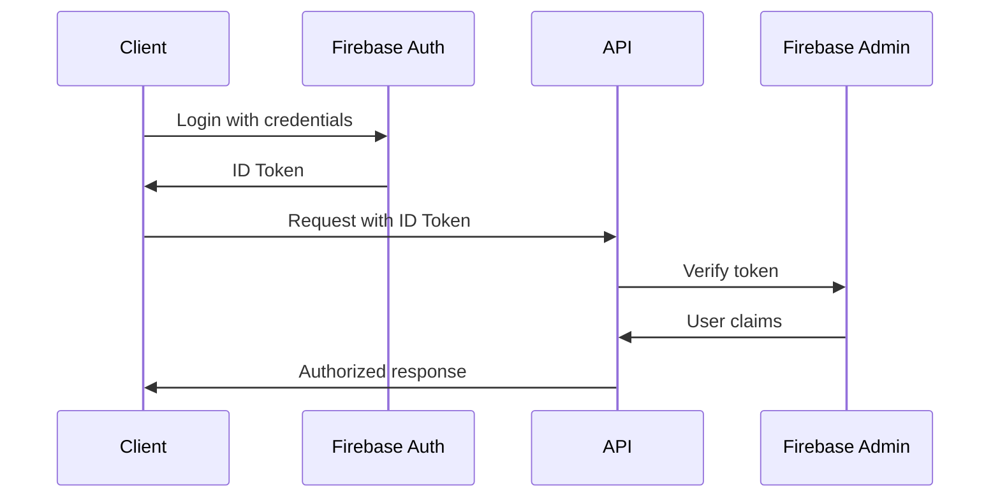

# Authentication API

## Overview

LabFlow uses Firebase Authentication with custom claims for role-based access control.

## Authentication Flow



## Endpoints

### Login

```typescript
POST /api/auth/login
Content-Type: application/json

{
  "email": "user@example.com",
  "password": "securepassword"
}

Response:
{
  "user": {
    "uid": "user123",
    "email": "user@example.com",
    "role": "lab_technician",
    "tenantId": "tenant123"
  },
  "token": "eyJhbGc..."
}
```

### Register

```typescript
POST /api/auth/register
Authorization: Bearer {adminToken}
Content-Type: application/json

{
  "email": "newuser@example.com",
  "password": "securepassword",
  "role": "lab_technician",
  "profile": {
    "firstName": "John",
    "lastName": "Doe"
  }
}
```

### Refresh Token

```typescript
POST /api/auth/refresh
Authorization: Bearer {refreshToken}

Response:
{
  "token": "eyJhbGc...",
  "expiresIn": 3600
}
```

## User Roles

```typescript
enum UserRole {
  SUPER_ADMIN = 'super_admin',
  ADMIN = 'admin',
  LAB_MANAGER = 'lab_manager',
  LAB_TECHNICIAN = 'lab_technician',
  PHLEBOTOMIST = 'phlebotomist',
  DOCTOR = 'doctor',
  NURSE = 'nurse',
  RECEPTIONIST = 'receptionist',
  PATIENT = 'patient'
}
```

## Token Usage

### Request Headers

```http
GET /api/patients
Authorization: Bearer eyJhbGc...
X-Tenant-ID: tenant123
```

### Token Payload

```json
{
  "uid": "user123",
  "email": "user@example.com",
  "role": "lab_technician",
  "tenantId": "tenant123",
  "permissions": ["read:patients", "write:results"],
  "iat": 1623456789,
  "exp": 1623460389
}
```

## Security Measures

1. **Token Expiration**: 1 hour for access tokens
2. **Refresh Token Rotation**: New refresh token on each use
3. **Rate Limiting**: 5 login attempts per minute
4. **IP Whitelisting**: Optional for enterprise accounts
5. **2FA Support**: TOTP-based two-factor authentication